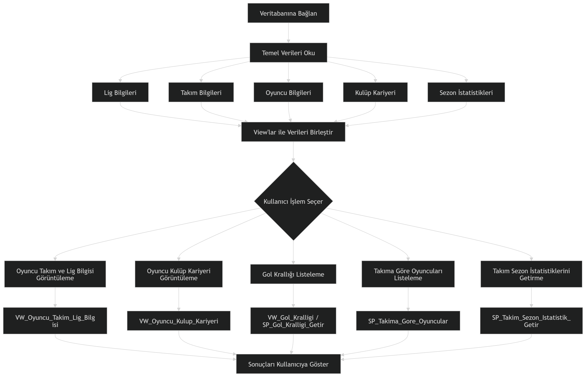
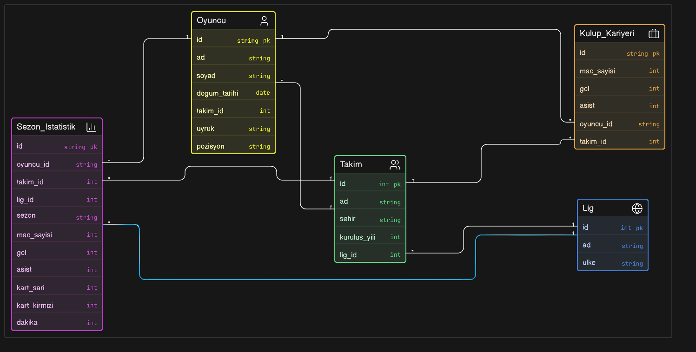

<h1 align="center">
  SPORCU İSTATİSTİK SİSTEMİ
</h1> 

<h2 align="center">  Problem Tanımı </h2>
Bu proje'nin amacı sporcuların sezon performanslarının, kariyer bilgilerinin ve istatistiklerinin düzenli, ilişkisel ve yönetilebilir şekilde saklanmasını amaçlayan bir Sporcu İstatistik Veritabanı Sistemi geliştirilmektir.
Sistem içerisinde gol, asist, maç sayısı, kart istatistikleri, oynadığı takım ve lig bilgileri bulunmaktadır. Ayrıca sistemde iki farklı sporcunun istatistiklerini karşılaştırma özelliği de bulunmaktadır. Böylece sporcuların performanslarını analiz edebilmekte ve detaylı karşılaştırmalar yapabilmektedir.
Bu sayede sporcu verilerinin daha düzenli yönetilmesi, analiz edilmesi ve hızlı şekilde sunulması hedeflenmiştir.
<h2 align="center"> Yapılan Araştırmalar </h2>

Projeyi geliştirme sürecinde veri bütünlüğü, modülerlik ve sorgu performansı açısından çeşitli sorunlarla karşılaşılmış ve bu doğrultuda bazı araştırmalar yapılarak çözümler üretilmiştir

Veri Tekrarı
Oyuncu bilgileri, oynadıkları takımlar ve takımların bulunduğu ligler gibi birbiriyle bağlantılı verilerin tek bir tabloda tutulmasının veri tekrarına ve güncelleme anomalilerine yol açacağı tespit edilmiştir.
Çözüm olarak Lig, Takım ve Oyuncu verileri için sırasıyla Lig, Takim ve Oyuncu isimli ayrı tablolar oluşturulmuştur. Bu tablolar birbirine lig_id ve takim_id referansları üzerinden ilişkisel olarak bağlanmıştır
Ayrıca tablolardaki birincil anahtarların (Primary Key) veri eklendikçe otomatik olarak artması için IDENTITY(1,1) özelliği kullanılmıştır.

Sorgu Performans Sorunu
Oyuncuların kulüp kariyerleri ve sezonluk istatistikleri gibi birden fazla tablonun birleştirilmesini gerektiren uzun sorguların, raporlama sırasında sürekli baştan çalıştırılmasının performansı düşürebileceği gözlemlenmiştir.
Çözüm olarak sık kullanılan istatistiksel raporları sanal tablolar halinde önceden derlemek için VIEW yapıları kullanılmıştır.Sistemdeki veri akışını kolaylaştırmak amacıyla VW_Oyuncu_Takim_Lig_Bilgisi, VW_Oyuncu_Kulup_Kariyeri ve gol/asist sayılarını takım eşleşmeleriyle getiren VW_Gol_Kralligi görünümleri oluşturulmuştur.

Esnek Veri Çekimi
Uygulama üzerinden veritabanına sorgu atılırken sık tekrarlanan listeleme işlemlerinin tek bir standart üzerinden güvenli bir şekilde yönetilmesi gerekmiştir.
Parametre alabilen ve veritabanı sunucusu tarafında saklandığı için yüksek performans sunan STORED PROCEDURE kullanılmıştır. 
En çok gol atan 10 oyuncuyu azalan sırayla listeleyen SP_Gol_Kralligi_Getir
Dışarıdan girilen isim (@ad) ve soyisim (@soyad) parametrelerine göre oyuncunun kariyerini döndüren SP_Oyuncu_Kulup_Kariyeri_Getir 
Belirli bir takımın ID'si ile sezonluk istatistiklerini veren SP_Takim_Sezon_Istatistik_Getir yazılarak veri erişimi daha esnek hale getirilmiştir.

Genel ve Detaylı İstatistiklerin Ayrılması
Bir sporcunun tüm zamanları kapsayan genel kariyer verileri ile sadece belirli bir sezona ait detaylı performans verilerinin tek bir yapıda tutulmasının, istatistiksel analizi zorlaştıracağı belirlenmiştir.
Çözüm olarak da veriler kullanım amacına göre ikiye bölünmüştür. Genel toplamları yansıtan temel veriler için Kulup_Kariyeri tablosu (toplam maç, gol, asist) oluşturulurken; sezona göre ayrıştırılmış detaylı veriler (sarı kart, kırmızı kart ve oynanan dakika gibi) için Sezon_Istatistik tablosu tasarlanarak esnek bir hale getirlmiştir

<h2 align="center"> Akış Şeması </h2>

  

<h2 align="center">  Yazılım Mimarisi </h2>
Veritabanı için MSSQL kullanılmıştır. Burada sporculara ait bilgiler, sezon istatistikleri, kulüp kariyerleri, takım ve lig bilgileri ilişkisel tablolar halinde tutulmaktadır.

Tablolar arasında Primary Key ve Foreign Key ilişkileri kurulmuştur. Ayrıca verilerin daha düzenli çekilebilmesi için View yapıları, belirli işlemleri kolaylaştırmak için Stored Procedure yapıları ve veri doğruluğunu korumak için Trigger yapıları kullanılmıştır.

Backend için Node.js kullanılmıştır. Backend sistemi, frontend ile MSSQL veritabanı arasındaki veri iletişimini sağlanmıştır.

Frontend tarafından gönderilen istekler backend tarafından alınmakta, gerekli SQL sorguları çalıştırılmakta ve elde edilen veriler tekrar frontend tarafına gönderilmektedir. Böylece frontend tarafının doğrudan veritabanına erişmesi engellenmiş ve daha güvenli bir yapı oluşturulmuştur.

Frontend için React Native ve Expo kullanılmıştır. Kullanıcılar uygulama üzerinden sporcuları listeleyebilmekte, oyuncu detaylarını görüntüleyebilmekte ve iki farklı sporcunun istatistiklerini karşılaştırabilmektedir.

Frontend tarafında component yapıları kullanılarak kod tekrarının azaltılması ve daha düzenli bir proje yapısı oluşturulması amaçlanmıştır.

Proje geliştirme sürecinde ilk olarak MSSQL üzerinde veritabanı tasarımı ile başlamıştır. Oyuncu, takım, lig, sezon istatistikleri ve kulüp kariyeri tabloları oluşturulmuştur.

Daha sonra tablolar arasındaki ilişkiler kurulmuş, veri bütünlüğünü sağlamak amacıyla Foreign Key bağlantıları eklenmiştir. Sık kullanılan sorgular için View yapıları oluşturulmuş, belirli işlemleri kolaylaştırmak amacıyla Stored Procedure yapıları eklenmiştir.

Veritabanı işlemleri tamamlandıktan sonra Node.js kullanılarak backend sistemi geliştirilmiş ve MSSQL bağlantısı kurulmuştur.

Son aşamada React Native ve Expo kullanılarak kullanıcı arayüzü geliştirilmiş, sporcu listeleme, detay görüntüleme ve sporcu karşılaştırma özellikleri sisteme eklenmiştir.

<h2 align="center">  Veri Tabanı Diyagramı </h2>

  

<h2 align="center">  Genel Yapı </h2>

Proje sporculara ait istatistiksel verilerin düzenli şekilde saklanması, yönetilmesi ve kullanıcıya sunulması amacıyla geliştirilmiş bir Sporcu İstatistik Veritabanı Sistemidir.

Projede MSSQL kullanılarak ilişkisel bir veritabanı yapısı oluşturulmuştur. Sistem içerisinde oyuncular, takımlar, ligler, sezon istatistikleri ve kulüp kariyerleri gibi veriler ayrı tablolar halinde tutulmaktadır. Tablolar arasında Primary Key ve Foreign Key ilişkileri kurularak veri bütünlüğü sağlanmıştır.

Veritabanı tarafında ayrıca View, Stored Procedure ve Trigger yapıları kullanılmıştır. View yapıları sayesinde sık kullanılan sorgular daha düzenli hale getirilmiş, Stored Procedure yapıları ile belirli işlemler kolaylaştırılmış ve Trigger yapıları ile veri doğruluğu korunmuştur.

Backend tarafında Node.js kullanılmıştır. Backend sistemi, frontend ile MSSQL veritabanı arasındaki veri iletişimini sağlamaktadır. Kullanıcıdan gelen istekler backend tarafından işlenmekte ve gerekli veriler veritabanından çekilerek frontend tarafına gönderilmektedir.

Frontend tarafında React Native ve Expo kullanılmıştır. Kullanıcılar uygulama üzerinden sporcuları listeleyebilmekte, oyuncu detaylarını görüntüleyebilmekte ve iki farklı sporcunun istatistiklerini karşılaştırabilmektedir.

Proje geliştirme sürecinde ilişkisel veritabanı yönetimi, frontend-backend bağlantısı, veri modelleme ve mobil uygulama geliştirme konularında çalışmalar yapılmıştır.

<h2 align="center">  Referanslar </h2>

    [1] Microsoft SQL Server Documentation (MSSQL kullanımı ve SQL yapıları)
    https://learn.microsoft.com/sql/

    [2] React Native Resmi Dokümantasyonu ve Öğretici YouTube Kanalı (Frontend geliştirme)
    https://reactnative.dev/
    https://www.youtube.com/@notjustdev 

    [3] Expo Resmi Dokümantasyonu ve Öğretici YouTube Kanalı (Web uygulaması geliştirme süreci)
    https://docs.expo.dev/
    https://www.youtube.com/@notjustdev 

    [4] Node.js Resmi Dokümantasyonu (Backend geliştirme)
    https://nodejs.org/

    [5] W3Schools SQL Kaynakları (JOIN, VIEW ve SQL araştırmaları)
    https://www.w3schools.com/sql/

    [6] SQL Server Tutorial (Trigger ve Stored Procedure araştırmaları)
    https://www.sqlservertutorial.net/

    [7] Transfermarkt (Oyuncu ve takım verileri)
    https://www.transfermarkt.com/

    [8] FotMob (Maç ve sezon istatistik verileri)
    https://www.fotmob.com/

    [9] ChatGPT – OpenAI (Hata çözümleri)
    https://chat.openai.com/

    [10] OpenAI Codex (Kod geliştirme ve hata analizi desteği)
    https://openai.com/

